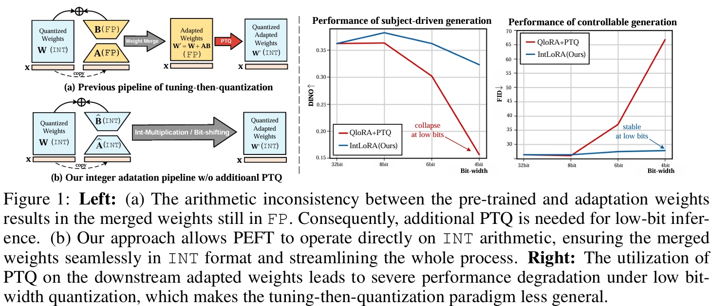
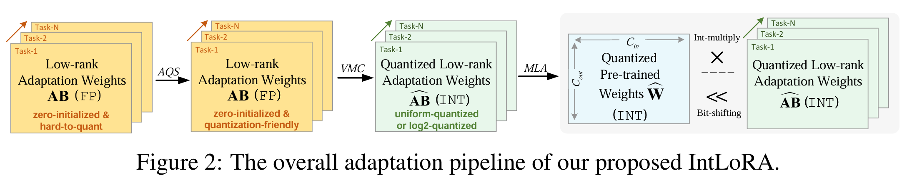

# IntLoRA: Integral Low-rank Adaptation of Quantized Diffusion Models

### [[Paper](https://arxiv.org/pdf/2410.21759)]

### Tune your customized diffusion model on ONE 3090 GPU!

[Hang Guo](https://csguoh.github.io/)<sup>1</sup> | [Yawei Li](https://yaweili.bitbucket.io/)<sup>2</sup> | [Tao Dai](https://scholar.google.com/citations?user=MqJNdaAAAAAJ&hl=zh-CN)<sup>3</sup>| [Shu-Tao Xia](https://scholar.google.com.hk/citations?user=koAXTXgAAAAJ&hl=zh-CN)<sup>1,4</sup>| [Luca Benini](https://scholar.google.com.hk/citations?user=8riq3sYAAAAJ&hl=zh-CN&oi=ao)<sup>2</sup>

<sup>1</sup>Tsinghua University, <sup>2</sup>ETH Zurich, <sup>3</sup>Shenzhen University, <sup>4</sup>Pengcheng Laboratory 


:star: If our IntLoRA is helpful to your images or projects, please help star this repo. Thanks! :hugs:


## TL; DR
> Our IntLoRA offers three key advantages: (i) for fine-tuning, the pre-trained weights are quantized, reducing memory usage; (ii) for storage, both pre-trained and low-rank weights are in INT which consumes less disk space; (iii) for inference, IntLoRA weights can be naturally merged into quantized pre-trained weights through efficient integer multiplication or bit-shifting, eliminating additional post-training quantization.

<p align="center">
    
</p>


## 🔎 Overview framework

<p align="center">
    
</p>


## ⚙️ Dependencies and Installation

### Step-1 Download and Environment

```
## git clone this repository
git clone https://github.com/csguoh/IntLoRA.git
cd ./IntLoRA
```

```
# create a conda environment
conda env create -f environment.yaml
conda activate intlora
```

### Step-2 Preparation

- This code repository contains [Dreambooth](https://arxiv.org/abs/2208.12242) fine-tuning using our IntloRA. One can download the subject driven generation datasets [here](https://github.com/google/dreambooth/tree/main/dataset).

- You also need to download the pre-trained model weights which will be fine-tuned with our IntLoRA. Here, we use the [Stable Diffusion-1.5](https://huggingface.co/CompVis) as a example.


### Step-3 Fine-tuning!

- The main file of the fine-tuning is defined in the `train_dreambooth_quant.py`. We have also give the off-the-shelf configuration bash file for you. Thus, one can directly train customized diffusion models with the following command.

  ```
  bash ./train_dreambooth_quant.sh
  ```

- The following are some key parameters that you may want to modify.

  - `rank`: the inner rank of the LoRA adapter
  - `intlora`: one can choose 'MUL' to use our InrLoRA-MUL or 'SHIFT' to use our InrLoRA-SHIFT
  - `nbits`: the number of bits of the weight quantization bits
  - `use_activation_quant`: whether to use the activation quantization
  - `act_nbits`: the activation bits of the activation quantization
  - `gradient_checkpointing `: whether to use the gradient checking to further reduce the GPU cost.

- After run the fine-tunning command above, you can find the generated results in the `./log_quant` file fold.

## 😄 Evaluation
- After generate the images, you can test the quality of each generated image using the following command:

```
python evaluation.py
```

- It will generate a `.json` file which contains the IQA results of each subject. Then we can obtain the overall evaluation result with 

```
python get_results.py
```


## 🎓Citations
If our code helps your research or work, please consider citing our paper.
The following are BibTeX references:


```
@article{guo2024intlora,
  title={IntLoRA: Integral Low-rank Adaptation of Quantized Diffusion Models},
  author={Guo, Hang and Li, Yawei and Dai, Tao and Xia, Shu-Tao and Benini, Luca},
  journal={arXiv preprint arXiv:2410.21759},
  year={2024}
}
```


